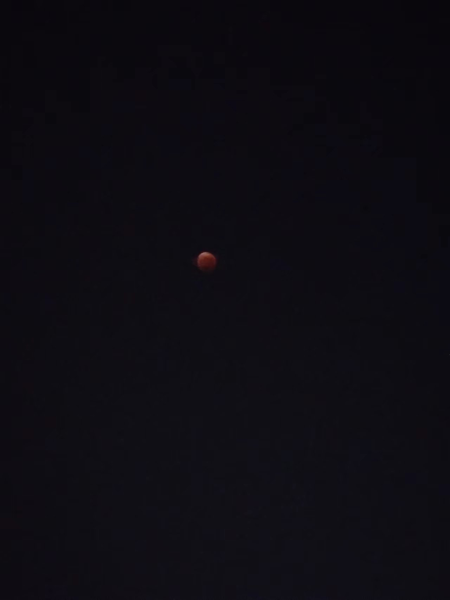

## 2022

个人描述：美好的青春时期

1. 年初有立什么目标吗？完成度怎么样？
    1. 第一个学期学习上：原来是不太好，但是最后收获的结果是好的
    2. 第二个学期就一直是下坡路的状态，所以觉得今年的年初目标的完成度就很低了
2. 今年最大的收获是？其他收获呢？工作和生活上
    1. 感觉很小啊，就是感受到了高中生活中的苦逼及数理化多么的难
3. 对明年的自己有什么期望吗？希望能够实现什么目标？
    1. 任务很重，反正现在学习就是生活,生活就是学习,其他方面没有什么太大的事
    2. 还要跟同学的交往关系好一些
    3. 然后还有就是今年因为有疫情，然后今年发烧的次数也比以前多，身体更健康一些
    4. 希望明年疫情可以好一些可以正常的，恢复线下上课
-----------------------------------------------------------------------------------------------------------------------------------------------------------------------
个人描述：没有

1. 年初有立什么目标吗？完成度怎么样？
    1. 拍车牌。就还没拍到。
2. 今年最大的收获是？其他收获呢？工作和生活上
    1. 厨艺吧，居家六七个月练就的。
    2. 其他就收获了钱。
3. 对明年的自己有什么期望吗？希望能够实现什么目标？
    1. 期望阳康且变强吧！
    2. 希望升职加薪！

-----------------------------------------------------------------------------------------------------------------------------------------------------------------------
个人描述：没有

1. 年初有立什么目标吗？完成度怎么样？
    1. 发一篇顶会，一篇顶刊；完成80%
2. 今年最大的收获是？其他收获呢？工作和生活上
    1. 最大的收获是两只小猫咪
3. 对明年的自己有什么期望吗？希望能够实现什么目标？
    1. 希望明年能提前毕业！

-----------------------------------------------------------------------------------------------------------------------------------------------------------------------

个人描述：Ctrl+CV的图像算法
1. 年初有立什么目标吗？完成度怎么样？
    1. 攒钱，完成度95%，有部分超出的支出，但在可控的范围
2. 今年最大的收获是？其他收获呢？工作和生活上
    1. 年前跳槽，安稳地适应了新的工作环境
    2. 年底阳🐏了，老婆工作+备考+考试+照顾卧病在床的自己，感受到家里的顶梁柱是她不是我
3. 对明年的自己有什么期望吗？希望能够实现什么目标？
    1. 还是攒钱，提前还了商贷
    2. 明年装修，终于到了花钱的时候

-----------------------------------------------------------------------------------------------------------------------------------------------------------------------

个人描述：呆瓜一号

1. 年初有立什么目标吗？完成度怎么样？
    1. 今年好像确实没立啥目标
2. 今年最大的收获是？其他收获呢？工作和生活上
    1. 工作还比较顺心，在新环境里交到了朋友
    2. 收获了一些肉🥩

3. 对明年的自己有什么期望吗？希望能够实现什么目标？
    1. 工作依然能够顺心就好
    2. 多出去走走
    3. 减肥啊

-----------------------------------------------------------------------------------------------------------------------------------------------------------------------
个人描述：活力💯的姑娘

这是她今年最酷的时刻
1. 年初有立什么目标吗？完成度怎么样？
2. 22年初搞钱，23年会思考
3. 今年最大的收获是？其他收获呢？工作和生活上
    1. 工作：无非是一种谋生手段
    2. 生活：户外，6月武功山，9月腾格里，10月雨崩，体能增强可完成单日4星线
4. 对明年的自己有什么期望吗？希望能够实现什么目标？
    1. 自由的灵魂，真正热烈的活着

-----------------------------------------------------------------------------------------------------------------------------------------------------------------------
个人描述：想搞钱的姑娘

她说这是她的全部后盾--家

1. 年初有立什么目标吗？完成度怎么样？
    1. 年初想着存钱，年末发现没有完成自己存的指标
2. 今年最大的收获是？其他收获呢？工作和生活上
    1. 工作上，思想已走到了末路，无法进一步优化工作方法
    2. 开始存钱，开始有底气，家人啥坏了或者不好了可以直接换新的
3. 对明年的自己有什么期望吗？希望能够实现什么目标？
    1. 早日实现财富自由
    2. 回老家盖一栋自己喜欢的房子装修成喜欢的样子，日出而作日落而息

-----------------------------------------------------------------------------------------------------------------------------------------------------------------------
个人描述：想搞钱的单男

1. 年初有立什么目标吗？完成度怎么样？
    1. 攒钱
2. 今年最大的收获是？其他收获呢？工作和生活上
    

3. 对明年的自己有什么期望吗？希望能够实现什么目标？
    1. 找个对象吧
 
 

他的征友照片

-----------------------------------------------------------------------------------------------------------------------------------------------------------------------
个人描述：躺平少年

1. 年初有立什么目标吗？完成度怎么样？
    1. 目标换一份工作，完成度80%吧
2. 今年最大的收获是？其他收获呢？工作和生活上
    1. 感觉今年没什么收获，上半年因为疫情封闭，下半年在家躺平了一段时间，换了一份工作
3. 对明年的自己有什么期望吗？希望能够实现什么目标？
    1. 明年希望生活能回到正规，希望有空能多看看祖国大好河山。努力赚钱！
-----------------------------------------------------------------------------------------------------------------------------------------------------------------------

个人描述：幻想中彩票的梦想家

1. 年初有立什么目标吗？完成度怎么样？
    1. 想着逃离互联网，跑路成功了
2. 今年最大的收获是？其他收获呢？工作和生活上
    1. 逃离互联网，不再加班，舒服
    2. 攒了点小钱，买了个小车，上班不冷
3. 对明年的自己有什么期望吗？希望能够实现什么目标？
    1. 工作顺利，别出差错
    2. 中奖500w
-----------------------------------------------------------------------------------------------------------------------------------------------------------------------
个人描述：搞钱搞生活的猪

1. 年初有立什么目标吗？完成度怎么样？
    1. 存一年钱买好猫（车）～并没有完成 
2. 今年最大的收获是？其他收获呢？工作和生活上
    1. 我家李先生
    2. 工作上：收获了降薪
    3. 生活上：收获了一个家庭
3. 对明年的自己有什么期望吗？希望能够实现什么目标？
    1. 好好生活，天天开心，可可爱爱，没有烦恼
    2. 希望明年能存够钱买好猫～

-----------------------------------------------------------------------------------------------------------------------------------------------------------------------
个人描述：是一个总是想很多的人

1. 年初有立什么目标吗？完成度怎么样？
    1. 木有呢，平凡地生活着 
2. 今年最大的收获是？其他收获呢？工作和生活上
    1. 工作上：接受了职场的深刻的教训，不要太听话啊啊啊啊啊
    2. 生活上：收获了一个一起生活的队友哈哈哈以及终于完成了减肥
3. 对明年的自己有什么期望吗？希望能够实现什么目标？
    1. 继续没有，希望家人健健康康，开开心心❤️
 
-----------------------------------------------------------------------------------------------------------------------------------------------------------------------
个人描述：正在🐏的单男

1. 年初有立什么目标吗？完成度怎么样？
    1. 年前想减肥来着，结果年末体重增了10几斤
2. 今年最大的收获是？其他收获呢？工作和生活上
    1. 工作上：把盐城那边的关系抓在自己手上了
    2. 生活上：一个人也挺好，自由自在
3. 对明年的自己有什么期望吗？希望能够实现什么目标？
    1. 一切都顺顺利利吧
-----------------------------------------------------------------------------------------------------------------------------------------------------------------------
个人描述：不想长大的孩子

1. 年初有立什么目标吗？完成度怎么样？
    1. 通过资格证书考试，考公上岸。目前完成了50%
2. 今年最大的收获是？其他收获呢？工作和生活上
    1. 工作上终于度过了一年的试用期
    2. 生活上先后收获了脂肪肝肾结石，以及新冠阳性带来的额外假期
3. 对明年的自己有什么期望吗？希望能够实现什么目标？
    1. 希望我能早日上岸，多多运动，有机会去爱豆💖演唱会
-----------------------------------------------------------------------------------------------------------------------------------------------------------------------
个人描述：躺平的已婚男士

我再一次看到老同学，确实壮了

1. 年初有立什么目标吗？完成度怎么样？
    1. 年初想着能够多逛几个地方，疫情影响哪儿也没去
2. 今年最大的收获是？其他收获呢？工作和生活上
    1. 除了身体健康，涨了些肌肉，再没有别的收获了
    2. 工作上平平淡淡，躺平了
3. 对明年的自己有什么期望吗？希望能够实现什么目标？
    1. 希望家人身体健康
    2. 明年疫情结束能够好好出去玩
    3. 希望能够涨薪
 ----------------------------------------------------------------------------------------------------------------------------------------------------------------------
 个人描述：不想被标签化的普通男子

1. 年初有立什么目标吗？完成度怎么样？
    1. 新工作稳定下来，结果是还在爬
2. 今年最大的收获是？其他收获呢？工作和生活上
    1. 工作上还在爬
    2. 结婚了，对目前生活挺满意
3. 对明年的自己有什么期望吗？希望能够实现什么目标？
    1. 平静心态面对所有 不要违背初心 心态淡薄
----------------------------------------------------------------------------------------------------------------------------------------------------------------------

个人描述：对自己没有标签

1. 年初有立什么目标吗？完成度怎么样？
    1. 多存钱，达到一个小目标；80%概率可以完成😅
2. 今年最大的收获是？其他收获呢？工作和生活上
    1. 总体比较顺利，也学习了不少
    2. 除了想见丈母娘的路途艰辛；总体还算快乐
3. 对明年的自己有什么期望吗？希望能够实现什么目标？
    1. 希望更洒脱些，不管工作还是生活；若跑路回老家，则希望找到一个好下家！
    2. 希望能够给丈母娘留个好印象，一举拿下鹰堡！
    3. 希望能多涨点工资，多存点钱，快点攒够首付吧！

----------------------------------------------------------------------------------------------------------------------------------------------------------------------
个人描述：追逐梦想的大龄学生

1. 年初有立什么目标吗？完成度怎么样？
    1. 发顶刊。未完成
2. 今年最大的收获是？其他收获呢？工作和生活上
    1. 中了论文。
3. 对明年的自己有什么期望吗？希望能够实现什么目标？
    1. 再发论文。早日毕业
----------------------------------------------------------------------------------------------------------------------------------------------------------------------
个人描述：躺平的小胖子

1. 年初有立什么目标吗？完成度怎么样？
    1. 搞钱买房子
    2. 买了房就剩贷款了
2. 今年最大的收获是？其他收获呢？工作和生活上
    1. 收获了一套房
    2. 养了一只狗
3. 对明年的自己有什么期望吗？希望能够实现什么目标？
    1. 顺利生下健康宝宝
    2. 别胖太多

----------------------------------------------------------------------------------------------------------------------------------------------------------------------

个人描述：苦逼的科研人

1. 年初有立什么目标吗？完成度怎么样？
    1. 想发两篇好论文。没有完成
    2. 想参与几个牛逼的项目本子。完成了
2. 今年最大的收获是？其他收获呢？工作和生活上
    1. 生活上，暂时还没阳，有望狗到决赛圈
    2. 工作上，协助师弟发了两篇trans
3. 对明年的自己有什么期望吗？希望能够实现什么目标？
    1. 想发两篇好论文
    2. 想参与几个牛逼的项目本子

----------------------------------------------------------------------------------------------------------------------------------------------------------------------
个人描述：莽撞人

1. 年初有立什么目标吗？完成度怎么样？
    1. 想去北京，第4次失败
    2. 莫名其妙，就瘦了
2. 今年最大的收获是？其他收获呢？工作和生活上
    1. 工作上，有了一份满意的体制内工作
    2. 生活上，内心充盈了许多
3. 对明年的自己有什么期望吗？希望能够实现什么目标？
    1. 工作上，工作顺利，合心意
    2. 生活上，出国游，少烦恼
----------------------------------------------------------------------------------------------------------------------------------------------------------------------
个人描述：有点野心的混子

1. 年初有立什么目标吗？完成度怎么样？
    1. 想开个店，疫情原因没开成
    2. 想去新疆，疫情原因也没去成，改去了呼伦贝尔
2. 今年最大的收获是？其他收获呢？工作和生活上
    1. 拿到了房子，按自己的想法装修了
    2. 换了份工作，还算满意
    3. 国庆去了呼伦贝尔，玩的很开心
3. 对明年的自己有什么期望吗？希望能够实现什么目标？
    1. 有点小存款，把自己的小店开起来
    2. 整辆摩托车玩玩

----------------------------------------------------------------------------------------------------------------------------------------------------------------------
个人描述：只想摆烂但无法摆烂

1. 年初有立什么目标吗？完成度怎么样？
    1. 接触一项新运动，完成度100%，会稍微帅气的滑板了
2. 今年最大的收获是？其他收获呢？工作和生活上
    1. 生活上：滑板认识了很多朋友社交圈变大了很多
    2. 工作上：安心摆烂
3. 对明年的自己有什么期望吗？希望能够实现什么目标？
    1. 跳槽
    2. 租个单身公寓养猫养狗

----------------------------------------------------------------------------------------------------------------------------------------------------------------------
个人描述：浪里小白龙

1. 年初有立什么目标吗？完成度怎么样？
    1. 好像没什么目标，就是佛系，但是想早点毕业，出点靠谱的成果吧。没有完成，还在路上
2. 今年最大的收获是？其他收获呢？工作和生活上
    1. 工作和生活上离毕业更近了一年，期待更好的未来
    2. 拖了快一年的访学，终于在DDL前两天出发了
3. 对明年的自己有什么期望吗？希望能够实现什么目标？
    1. 不要再躺了，大论文小论文都要完成了
    2. 去见女朋友的父母，希望一切顺利

