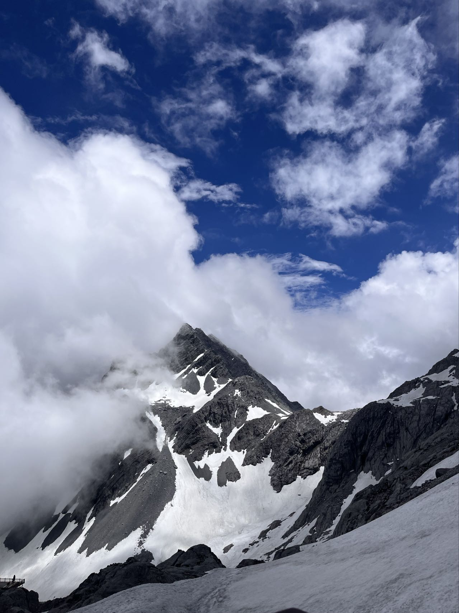
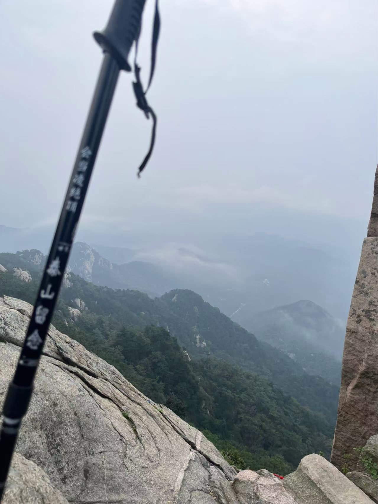
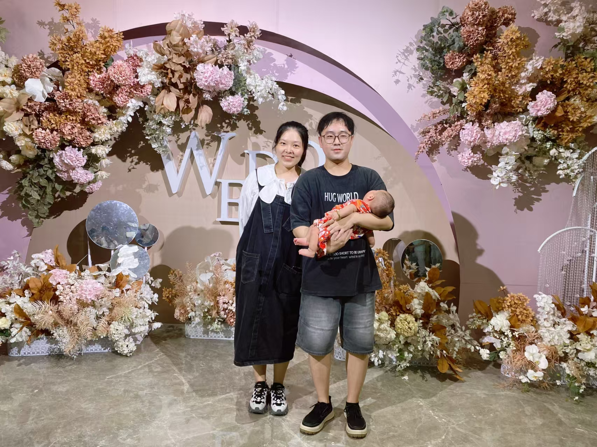

~~~python
1.年初有立什么目标吗？完成度怎么样？
2.今年最大的收获是？其他收获呢？工作和生活上
3. 对明年的自己有什么期望吗？希望能够实现什么目标？
4. 附一张觉得很有意义的照片. 
~~~

~~~python
1.年初有立什么目标吗？完成度怎么样？
	财富自由永远是第一目标吧，比去年好点
2.今年最大的收获是？其他收获呢？工作和生活上
	开始尝试各种工作以外的东西，父母身体比去年略有起色
3. 对明年的自己有什么期望吗？希望能够实现什么目标？
	愿身体健康，无忧无虑，坚守本心，不被花花世界眯眼，无论是我还是父母家人朋友
~~~

~~~
1.年初有立什么目标吗？完成度怎么样？
	年初计划争取荣誉，实现了一部分
2.今年最大的收获是？其他收获呢？工作和生活上
	收获是学会了更多的工作经验、对待工作的态度等
3. 对明年的自己有什么期望吗？希望能够实现什么目标？
	期望自己工作上精益求进，更进一步
~~~

~~~python
1.年初有立什么目标吗？完成度怎么样？
	安安稳稳平平安安 完成度100%
2.今年最大的收获是？其他收获呢？工作和生活上
	不是四喜，是摩卡，收获就是七个月的长假
3. 对明年的自己有什么期望吗？希望能够实现什么目标？
	明年希望自己能学会享受生活，每年都希望未来能躺平摸鱼
~~~

